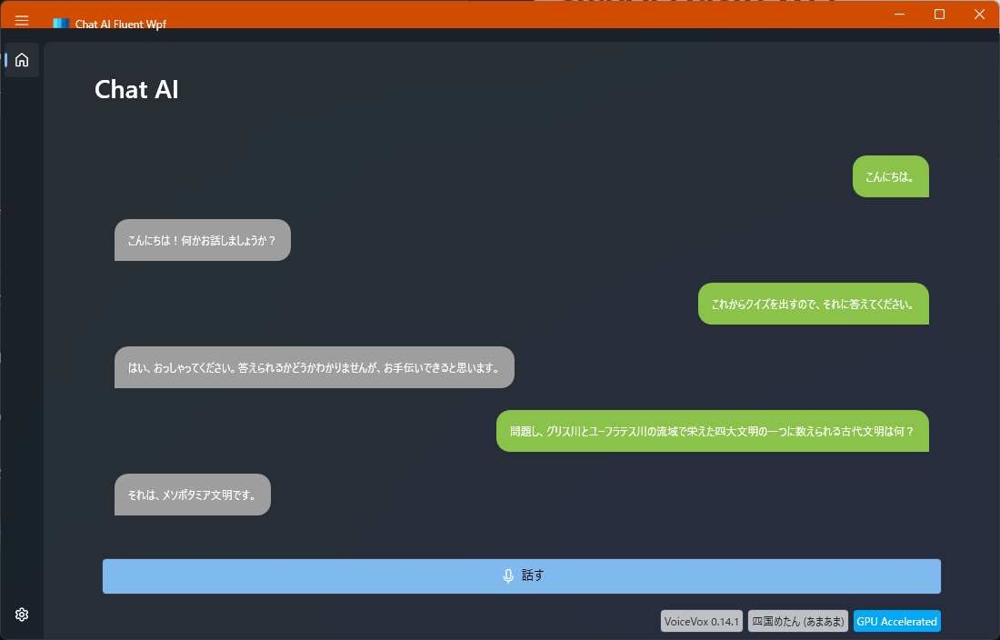

# ChatAI Fluent WPF



## Description

ChatGPTと会話するシンプルなチャットアプリです。

音声入力を文字列化してChatGPTに送り、返ってきた内容を合成音声で喋らせます。

音声入力には [Azure Cognitive Services (Speech to Text)](https://azure.microsoft.com/ja-jp/products/cognitive-services/speech-to-text/) を、音声合成には [VOICEVOX Core](https://github.com/VOICEVOX/voicevox_core) を利用しています。

## Requirement

- Windows 11 Pro 22H2+
- .NET 6
- Visual Studio 2022
- VOICEVOX Core 0.14.2

## Usage

はじめに VOICEVOX コアライブラリをセットアップします。

詳細は [VOICEVOX/voicevox_core](https://github.com/VOICEVOX/voicevox_core) を参照ください。

例えばCPUによる音声合成にはビルド出力先フォルダ (bin/Debug[Release]/net6.0-windows) 配下に以下のモジュール等を配置しておく必要があります。

- model/
- open_jtalk_dic_utf_8-1.11/
- onnxruntime.dll
- onnxruntime_providers_shared.dll
- voicevox_core.dll
- zlibwapi.dll

GPUによる音声合成には追加で以下のモジュールが必要です。

- cublas64_11.dll
- cublasLt64_11.dll
- cudart64_110.dll
- cudnn_adv_infer64_8.dll
- cudnn_cnn_infer64_8.dll
- cudnn_ops_infer64_8.dll
- cudnn64_8.dll
- cufft64_10.dll
- curand64_10.dll
- onnxruntime_providers_cuda.dll
- onnxruntime_providers_tensorrt.dll

zlibwapi.dll は[NVIDIA Developer](https://docs.nvidia.com/deeplearning/cudnn/install-guide/index.html#install-zlib-windows) で入手可能です。

## Install

このリポジトリをフォークしてクローンします。

```
$ git clone git@github.com:yourname/ChatAIFluentWpf.git
```

## Contribution

1. このリポジトリをフォークする
2. 変更を加える
3. 変更をコミットする
4. ブランチにプッシュする
5. プルリクエストを作成する

## License

MIT License

## Author

[minato](https://blog.minatoproject.com/)
